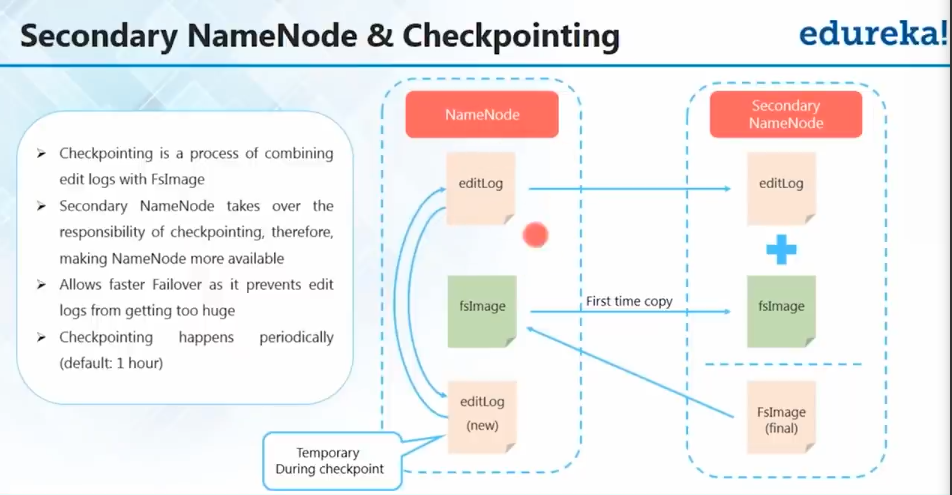

# Hadoop Core Components

## HDFS

- Storage :- Distributed file system
- Name Node
  - Master Daemons
  - Maintains and Manages DataNodes
  - Records metadata of data nodes lke location, size, premissions, hierarchy..etc
  - heartbeat of datanodes
- Data Node
  - Slave daemons
  - Stores actual data
  - Serves read and write requests from the clients
- Secondary NameNode
  - Checkpointing :- process of combining edit logs and FSImage (editLog + FsImage = New FsImage)

# contents of NameNode

- EditLog
- FsImage
- editLog (new)

# contents of secondary namenode

- editLog
- fsImage
- fsImage(final)

# HDFS Data Blocks

- Each file is stored on HDFS as blocks
- Default size of each block is 128MB in 2.x and 64Mb in 1.x
- 380MB file = 128MB block + 128MB block+ 124MB block
- Highly scalable
- Reduced processing time (Paralelly processed)

# Fault Tolerance

- Replication Factor
- Commodity hardware
- Never put all your eggs in the same basket

# HDFS Write Mechanism

- Three step process
  1. Setting up HDFS write pipeline
