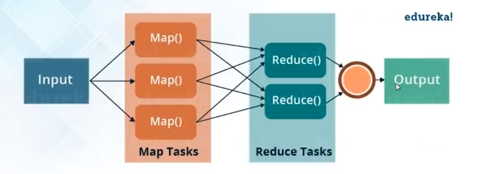

# MapReduce

- Allows Parallel and distributed processing
- Story: Student Read book and find freq of particular word 4H=> divide chapters and parallelly traverse chapters to find the frequency of particular word 1H and Teacher add freq to get word count.

**MapReduce is a programming framework that allows us to perform distributed and parallel processing on large data sets in a distributed environment**

